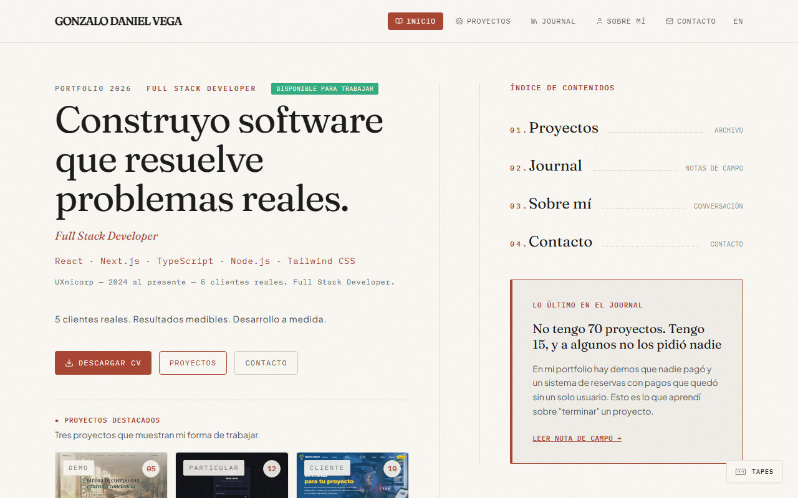

# Gonzalo Daniel Vega — Portfolio

Personal portfolio of **Gonzalo Daniel Vega**, Full Stack Developer with product sense. Bilingual (es/en), built as an SPA with per-route prerendering: projects, a field journal, an interactive credential badge with a scannable QR, and a contact form that delivers to the inbox.

**Live at [gonzalodanielvega.com](https://gonzalodanielvega.com)**

<p align="center">
  
</p>

## Highlights

- **Credential badge (`DevBadge`)** — a conference-style ID card that flips to show a QR code. Scanning it downloads the localized PDF CV, served as an attachment by a server header rather than an HTML attribute, so it works from a scanned QR in any browser.
- **Real SEO, not sprinkles** — every route gets its own canonical, `hreflang` es/en/x-default, Open Graph / Twitter cards, and JSON-LD (`Person`, `CreativeWork`, `Article`). Unknown URLs are labeled `noindex` and collapse onto the homepage, so the SPA catch-all never leaks soft 404s into the index.
- **One source of truth for the domain** — the canonical origin lives in a single `site.config.json`, consumed by the runtime, the sitemap generator, and the `index.html` transform. Changing the domain is a one-line edit.

## Stack

- **React 19** + **Vite 6** + **TypeScript**
- **Tailwind CSS 4** via the official Vite plugin
- **React Router 7** — bilingual routes under `/en` with a custom `LanguageContext`
- **Motion** — animations
- **Lucide** — icons
- **qrcode** — QR generation in the credential badge
- **@fontsource** — Fraunces, IBM Plex Mono, Plus Jakarta Sans
- **Resend** — serverless contact form (`/api/contact`)
- **Playwright + sharp** — build-time prerendering and deterministic image optimization

## Scripts

```bash
npm install           # installs dependencies + Playwright Chromium (postinstall)
npm run dev           # dev server at http://localhost:3000
npm run build         # sitemap -> optimize foto -> og image -> vite build -> prerender
npm run build:skip-prerender  # same without the Playwright pass (no static HTML per route)
npm run prerender     # re-run only the prerender against the current dist/
npm run preview       # serve the built site locally
npm run lint          # ESLint (src + api + scripts) + typecheck (tsc --noEmit)
npm run format        # Prettier over src
npm run screenshots   # (re)capture published project covers as 1280x800 jpg
npm run optimize:foto # optimize the profile photo to webp
```

The build is fully reproducible: it generates and validates `sitemap.xml` (**fails** if a project has no published cover and no explicit fallback declared, or if `src/data/gallery.ts` claims screenshots that are not on disk), optimizes the profile photo, composes the 1200x630 social preview and the iOS touch icon, compiles with Vite, then prerenders all 48 URLs (24 pages × es/en) with Playwright so crawlers receive static HTML.

Any failure in that last step fails the build. A prerender that quietly skips leaves a deploy that looks green while serving an empty shell with no title, no `og:image` and no content — so skipping has to be asked for explicitly with `npm run build:skip-prerender`.

## Running the contact form locally

`/api/contact` needs a Resend API key:

```bash
cp .env.example .env.local   # then fill in RESEND_API_KEY
```

A submission sends two emails: the message itself to the author's inbox, and a receipt to the visitor in the language they were browsing in, pointing at WhatsApp for anything urgent. The receipt is only attempted after the main message is accepted, and if it fails it is logged without failing the request — the visitor already got through. Nothing is stored server-side.

The endpoint validates and length-caps every field, drops honeypot hits, and rate limits to 5 submissions per hour per IP. Responses are stable error codes that the client translates, so provider internals never reach the page.

| Variable | Required | Default |
| --- | --- | --- |
| `RESEND_API_KEY` | yes | — |
| `CONTACT_FROM` | no | `Portfolio GDV <onboarding@resend.dev>` |
| `CONTACT_TO` | no | the author's inbox |

`CONTACT_FROM` needs a domain verified in Resend. Until then the sender falls back to `onboarding@resend.dev`, which only delivers to the address registered on the Resend account, so the form reports `sender_unverified` instead of failing silently. Verified domains are included in the free plan; see `.env.example` for the details.

## Project structure

```
api/contact.ts            Serverless contact endpoint (Resend, validation, rate limit, receipt)
api/cv.ts                 Localized CV download with Content-Disposition
scripts/                  Build: sitemap with cover + gallery guards, prerender, OG image
src/components/           DevBadge, Layout, PageMeta (per-route SEO), Studio Tapes, details
src/data/                 Projects, journal, tapes (es/en), gallery counts, profile, site
src/i18n/                 LanguageContext, translations, helpers
src/lib/                  safeStorage, useFocusTrap, journalMeta (dates, reading time)
src/pages/                Home, Portfolio, Journal, About, Contact, 404
site.config.json          Canonical origin (the only place the domain lives)
vercel.json               Rewrites, security headers, cache, conditional PDF download
```

## Deployment

Designed for **Vercel** — `vercel.json` defines the build command, the SPA rewrites, and long-lived asset caching; a small `/api/cv` serverless function streams the résumé PDF as an attachment (while the plain `/cv-{es,en}.pdf` URLs keep previewing inline).

1. Push to GitHub and import the repo in Vercel (framework preset: **Vite**).
2. Set the env variable `RESEND_API_KEY` for the contact form.
3. Delegate your domain's nameservers to Vercel and add it to the project.
4. Node 22+ is recommended to match the local toolchain exactly.

## License

All rights reserved — this is a personal portfolio meant to be read, not copied. No license is granted for reuse of the code or content without explicit permission.